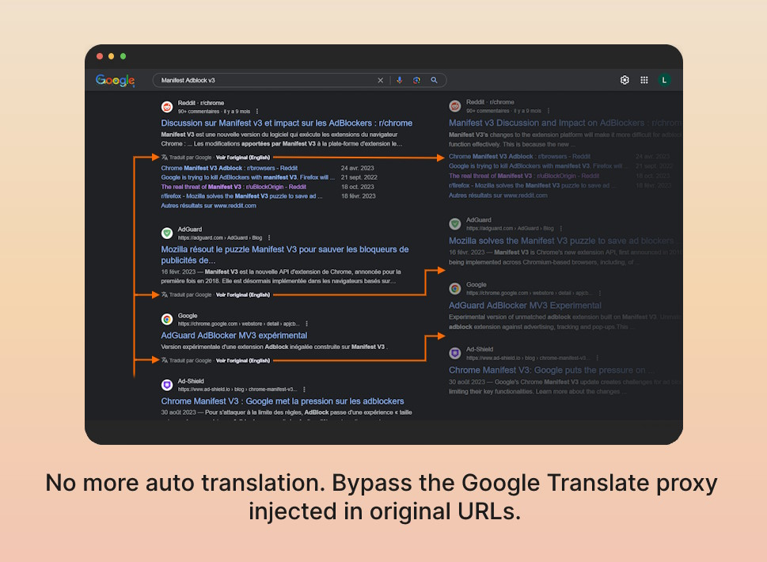

[![Badge Firefox]][Firefox] [![Badge Chrome]][Chrome] [![Badge Edge]][Edge]

**No Google Search Translation** is a browser extension to untranslate Google Search results. It also detects and redirects away from Google Translate proxy pages, taking you directly to the original URLs.

Using Edge, Brave, Vivaldi or Opera, you should be able to install it from the Chrome Webstore. Opera Store doesn't seem to want to validate the extension. 

[Chrome]: https://chromewebstore.google.com/detail/no-google-search-translat/kdibhchppeokcmdamhekocbnkjkodoii
[Badge Chrome]: https://img.shields.io/chrome-web-store/rating/kdibhchppeokcmdamhekocbnkjkodoii?label=Get%20on%20Google%20Chrome%20(Chromium)&style=for-the-badge&logo=google-chrome
[Firefox]: https://addons.mozilla.org/firefox/addon/no-google-search-translation/
[Badge Firefox]: https://img.shields.io/amo/rating/no-google-search-translation?label=Get%20on%20Firefox&style=for-the-badge&logo=firefoxbrowser
[Edge]: https://microsoftedge.microsoft.com/addons/detail/no-google-search-translat/ldcpobigcccphnajlohdpgjadfpdmipi
[Badge Edge]: https://img.shields.io/badge/Microsoft_Edge-Get_It-0?style=for-the-badge

# Showcase

Bonus on Firefox: it cleans the tab's navigation history to prevent the back button to redirect you to the Google Translate proxy.

# Context

## What is the problem?

> To help address content and perspective gaps when a user searches in their local language, sometimes Google may translate the title link and snippet of a search result for results that aren't in the language of the search query, when available.
> https://developers.google.com/search/docs/appearance/translated-results

This feature seems to be more globaly deployed since december 2023 (at least for me and some complaints on social networks), but first occurences of the feature can be found at least in [september 2022](https://web.archive.org/web/20220918204136/https://developers.google.com/search/docs/appearance/translated-results).

There is no easy way to just disable **this** feature, so this extension is here to help until Google provide a way to disable it.

## Security concerns

- [Google Translate XSS](https://www.youtube.com/watch?v=Nk9jehNhqVc) proof of concept (2012);
- [ Google Translate Tricks Spam Filters ](https://www.bitdefender.com/blog/hotforsecurity/google-translate-tricks-spam-filters/) - Bitdefender (2013);
- [Hacker group uses Google Translate to hide phishing sites](https://www.zdnet.com/article/hacker-group-uses-google-translate-to-hide-phishing-sites/) - ZDNET (2019)
- [Google Translate is being hijacked by phishers to steal your data](https://www.techradar.com/news/google-translate-is-being-hijacked-by-phishers-to-steal-your-data) - Techradar (2022);
- [Threat actors using images, Google translate links, and special characters to launch phishing attacks](https://blog.osarmor.com/333/google-translate-used-in-phishing-attack/) - OSArmor (2023);
- [Google Translate Used in Phishing Attack to Bypass Antispam Filters](https://www.vadesecure.com/en/blog/new-phishing-attack-leverages-google-translate-and-ipfs-decentralized-network) with IPFS Decentralized Network - Vade Secure (2023).

# Why the extension isn't working?

If not working, please check first that you approved the websites access permissions in the extension settings. Check help pages for [Firefox](https://support.mozilla.org/en-US/kb/manage-optional-permissions-extensions) and [Chrome](https://support.google.com/chrome_webstore/answer/2664769). If you are using a Chromium browser, you should be able to follow the Chrome help page.

This fix is hacky, the extension is heavily relying on the structure of the Google Search page. If Google change it, the extension will not work anymore. You might even be just unlucky and the chosen one for a Google Live Experiments. Or maybe just some cross-extensions incompatibilities.

If you find a bug or want to share some feedback, please open an issue. Or even a pull request!

Discussions tab is also open if you want to share your thoughts for more complex topics. For something that can't be resolved in a quick *one-shot*.

# Development

The extension is powered by the [Plasmo](https://docs.plasmo.com/) framework. First, you need to install [pnpm](https://pnpm.io/) (or npm *ewh!*) and run `pnpm install` (or `npm install`) to install all dependencies.

## Commands

| Command                                                                   | Action                                                                               |
| :------------------------------------------------------------------------ | :----------------------------------------------------------------------------------- |
| `pnpm dev:[firefox,chromium]` or `npm run dev:[browser]`                    | Run the development server for hot reload testing targeting either Firefox or Chrome(-ium) |
| `pnpm build` or `npm run build`                                           | Build Firefox and Chrome(-ium) production extensions with manifests v3               |
| `pnpm build:zip` or `npm run build:zip`                                   | Build Firefox and Chrome(-ium) extensions packages and zip                           |
| `pnpm build:[firefox,chromium,edge,opera]`  or `npm run build:[browser]` | Build the extension package with manifest for the targeted browser                   |
| `pnpm plasmo help` or `npm run plasmo help`                               | Show CLI Plasmo help                                                                 |

Currently, the extension is only tested on Firefox and Edge. It should work on every Chromium-browser. There is no extension for Safari because I can't test it. If you want to add support for it, feel free to open a pull request.

## Project structure

- `assets/` contains the extension icon and the screenshots for the README and addons stores content.
- `background/messages/` contains the service worker handling the auto redirection;
- `build/` contains the production build for each browser (created automatically when using the `build` command);
- `contents/` contains the content scripts;
- `popup.tsx` contains the React component for the extesnion popup.

## Testing with side-loading

To live test the code, open your browser and load the appropriate development build. For example, if you are developing for Edge, using manifest v3, use: `build/chrome-mv3-dev`. For Firefox, use `build/firefox-mv2-dev`.

Here the official documentation pages for the steps to follow:
* Firefox: https://firefox-source-docs.mozilla.org/devtools-user/about_colon_debugging/index.html#extensions
* Edge: https://learn.microsoft.com/en-us/microsoft-edge/extensions-chromium/getting-started/extension-sideloading

And [here](https://docs.plasmo.com/framework/workflows/dev) some details from Plasmo framework documentation.

# Alternatives

## Privacy and search engines

Google Search is not the only search engine on the web If you are concerned about your privacy, you could use:
- [DuckDuckGo](https://duckduckgo.com/);
- [Startpage](https://www.startpage.com/);
- [Brave Search](https://search.brave.com/);
- [Yep](https://yep.com/);
- One instance of [Searx](https://searx.space/);
- One instance of [Whoogle](https://github.com/benbusby/whoogle-search#public-instances);
- Etc.

Some are using Google Search results (like Startpage), others build their own index (like DuckDuckGo), some are mixing. You can find more information on [PrivacyTools.io](https://www.privacytools.io/providers/search-engines/).

## User script

You can also use [this user script](https://webapps.stackexchange.com/a/173236) made by David Trapp.

Note that the text `Original ansehen` needs to be changed based on what language the results are translated to as stated by the user script author. Also, you might want to change the `@match` value to make it work on the Google Search domain name you use. The script is not bypassing the Google Translate proxy, so you will still be redirected to the Google Translate proxy page traducting the original page.

## Switch Google Search interface main language

If you don't want to use an extension or a userscript, you could switch Google Search interface main language to English by going to [settings](https://www.google.com/preferences?hl=en&lang=1) and changing the language in the "Language" section. This could prevent Google from translating the search results, but it doesn't always work from online feedback, and it forces you to use... English.
